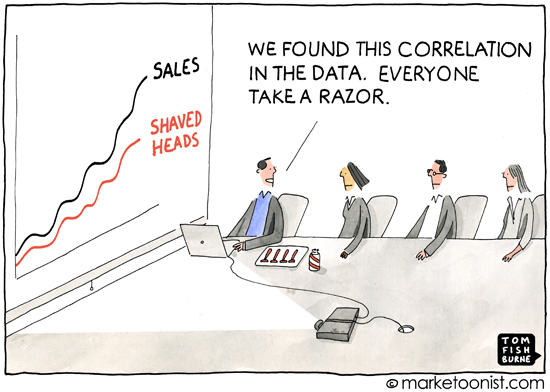

```{r setup, include=FALSE}
knitr::opts_chunk$set(echo = FALSE)
```

# Motivation

```{r, out.width= "80%", out.height = "80%", fig.align='center'}
library(knitr)
setwd("~/Desktop/SOSE2021/causal_ml")

```

# Introduction

 | Association-based Concepts |  Causal Concepts
|--------------------------|------------------------|
| Correlation              | Randomization  
| Regression               | Confounding
| Conditional Independence | Disturbance
| Likelihood               | Error Terms      
| Odds Ratio               | Structural Coefficients       
| Propensity Score         | Spurious Correlation    

Table: [@pearl2012causal]

# Table of Contents

* Foundations of SCMs 
  * Assumptions 
  * Comparing Causal Tools 
* Pearl's Causal Hierachy 
  * Prediction 
  * Intervention 
  * Counterfactuals 
  * Implications 
* Graphical Models 
  * Features 
  * Implications
* Causality and Time 

# Foundations of SCMs (1)

- System of equations with functions
- Assignment equation ':=' rather than regular equation '=' 
- Nonparametric SEM 
- This algebraic equation would imply that $B=A$ because the order has no concrete meaning in algebraic equations (symmetry)
- The initial $'='$ sign was replaced with the ':=' which is asymmetric (Pearl, 2009) and called an **assignment**.
- As mentioned, we define variables as functions e.g. $A=f_A(B,U_A)$.

**Error:* **
Regression: Omittable outside factor 
SCM/SEM; Latent influential factor that is pivotal for the model specification but not observable 

$$C:= N_c$$
$$E:=f_E(C,N_E)$$

source: @peters_elements_2017

# Assumptions in Causality 

Independence: 

- noise terms independent
- mechanisms independent (other variables invariant)(local changes)
- change in distribution stems from change in mechanism 

- Causal Markov Condition allows to factorize 
- Each Conditional is a causal mechanism

Source: [@peters_elements_2017]

# Assumptions in Causality (2)

**Established Conditions:**

Definition: **SUTVA**

'The treatment that one unit receives does not change the effect of treatment for any other unit.'[@hardtrecht]

Definition: **Consistency** 

The outcome Y agrees with the potential outcome corresponding to the treatment indicator.' [@hardtrecht]

Definition: **Ignorability**

The potential outcomes are conditionally independent of treatment given some set of de-confounding variables. [@hardtrecht]
(perfect RCT)

- First tow hold for SCM counterfactuals 
- third not testable but can check via backdoor criterion in SCM

# SCM Applications: 

- Flexible simulations for higher order problems (intervention, counterfactual)
- Graphical visualization via directed acyclic graph
- Example: SCM for fairness in dynamical system [@creager] : credit loan approval, time allocation, college admission  

# Fundamental Differences (1)

- conflict whether to use graphs or not 
* A SEM is a parametric specification used in applied sciences (parameters contested)
* A Bayesian causal network is another popular causal model using conditional probabilities and NO functions 
* Differences in performance between BCN and SCM# Performance Evaluation

# Pearls Causal Hierachy 

\footnotesize
 |Method          | Action |  Example | Usage | 
|------------------|-------------|--------------------|-------------------|
| Association $P(a|b)$               | Co-occurrence             | What happened...               |(Un-)Supervised ML, BN, Reg.  
| Intervention $P(a|do(b),c)$       | Do-manipulation           | What happens if ...            |CBN,MDP,RL    
| Counterfactual $P(a_b|a`,b`)$     | Hypotheticals   | What would have happened if...           | SCM ,PO            

Table: Pearls Hierachy of Causation (2009)

\normalsize

# Prediction 

- ML, BN and regression are at the lowest level in the causal hierarchy
- Prediction methods demand the least information and depend on association alone
- Associational methods ignore external changes outside of our data.
- intervention distribution has information on these external changes.
- intervention distribution is only defined in high level causal methods. 

# Intervention 

- The second query deals with interventions
- Mathematical Tool: do-calculus
- The do-calculus enables us to study the manipulation of parent nodes
- There are various types of intervention
- One example is **atomic intervention,** where we set a variable to a constant
- In **policy intervention** we specify a different function for an equation
- Off-policy intervention models different intervention that is not in our historical data
- CBN , MDP and reinforcement learning model intervention.

# Example Intevention (1)
**Atomic Intervention**:

- by replacing function with a constant

$$C_1:= f_{c_1}(p,N_1) \rightarrow C_1:=600$$
$$C_2:= f_{c_2}(a,N_2)$$
$$E:=f_E(C_1,C_2,N_E)$$

# Example Intevention (2)

**Policy Intervention:**

- Intervention by replacing function with a different conditional probability

$$C_1:= f_{c_1}(p,N_1) \rightarrow C_1:=f(\pi)$$
$$C_2:= f_{c_2}(a,N_2)$$
$$E:=f_E(C_1,C_2,N_E)$$


# Counterfactuals 

- missing data problem in PO framework 

Process is described as follows:

(a) Abduction: Cast probability $P(u)$ as conditional probability $P(u|\epsilon)$ 
(b) Action: Exchange $(X = x)$ 
(c) Prediction: Compute $(Y = y)$

# Graphical Tools

- Nodes -> Variables (endogenous/exogenous)
- Edges -> relationship (equations)
- Parents/Ancestors/Descendents
- No need to specify exact parametric shape
- highlight colliders 
- estimation back door criterion 
- Test theoretical model structure via causal algorithms to detect structure in data (IC/PC Algo.) 

# Graphical Illustration - Probabilisitic Model 

```{tikz,fig.align="center",fig.cap="Probabilistic Model", echo =F}
\usetikzlibrary{calc}
\usetikzlibrary{positioning}
\usetikzlibrary{arrows}
\begin{tikzpicture}[
    sharp corners=2pt,
    inner sep=7pt,
    node distance=3cm,
    >=latex]
\tikzstyle{my node}=[draw, shape = circle, minimum height=1cm,minimum width=1cm]
\node[my node] (A){A};
\node[my node,right =1 cm of A](C){C};
\node[my node] at ($(A)!0.5!(C)-(0pt,1.5cm)$) (T) {T};
\draw[->] (A) -- (T);
\draw[->] (A) -- (C);
\draw[->] (T) -- (C);
\end{tikzpicture}
```

# Graphical Illustration - Structural Causal Model 

```{tikz,fig.cap="Structural Causal Model", fig.align="center", echo =F}
\usetikzlibrary{calc}
\usetikzlibrary{positioning}
\usetikzlibrary{arrows}
\usetikzlibrary{calc}
\usetikzlibrary{positioning}
\usetikzlibrary{arrows}
  \begin{tikzpicture}[
    sharp corners=2pt,
    inner sep=6pt,
    node distance=2cm,
    >=latex]
\tikzstyle{my node}=[draw, shape = circle, minimum height=1cm,minimum width=1cm]
\tikzstyle{latent}=[draw, shape = rectangle, minimum height=1cm,minimum width=1cm]
\node[my node, fill=gray!30] (A){A};
\node[latent,left of=A](UA){$U_A$};
\node[my node, fill=gray!30] at ($(A)!0.5!(A)-(0pt,1.5cm)$) (T) {T};
\node[my node,right = 1 cm of T, fill=gray!30](C){C};
\node[latent,left = 1cm of T](UT){$U_T$};
\node[latent,right = 1cm of A](UC){$U_C$};
\draw[->] (A) -- (T);
\draw[->] (UA) -- (A);
\draw[->] (UT) -- (T);
\draw[->] (UC) -- (C);
\draw[->] (A) -- (C);
\draw[->] (T) -- (C);
\end{tikzpicture}
```

# Causality and Time

- Time in Physical Sciences: Mechanical and exact 
- Time in Social Sciences: Often Vague 
- Regular Time Specification is also more vague 
- To accommodate that issue, research on differential equation based SCMs started

# Causal Modelling with Differential Equations 

Intial Value: 

$$
\mathbf{x}\left(t_{0}\right)=\mathbf{x}_{0}
$$


$$
\frac{d \mathbf{x}}{d t}=f(\mathbf{x}), \mathbf{x} \in \mathbb{R}^{d}
$$

$$
\mathbf{x}(t+d t)=\mathbf{x}(t)+d t \cdot f(\mathbf{x}(t))
$$

# Graphical Overview

\scriptsize

$$
\begin{array}{|l|l|l|l|l|}
\hline \text { model } & \begin{array}{l}
\text { predict in IID } \\
\text { setting }
\end{array} & \begin{array}{l}
\text { predict under } \\
\text { changing } \\
\text { distributions / } \\
\text { interventions }
\end{array} & \begin{array}{c}
\text { answer } \\
\text { counter- } \\
\text { factual } \\
\text { questions }
\end{array} & \begin{array}{l}
\text { obtain } \\
\text { physical } \\
\text { insight }
\end{array} \\
\hline \begin{array}{l}
\text { mechanistic } \\
\text { model }
\end{array} & \mathrm{Y} & \mathrm{Y} & \mathrm{Y} & \mathrm{Y} \\
\hline \begin{array}{l}
\text { structural } \\
\text { causal model }
\end{array} & \mathrm{Y} & \mathrm{Y} & \mathrm{Y} & \mathrm{N} \\
\hline \begin{array}{l}
\text { causal } \\
\text { graphical } \\
\text { model }
\end{array} & \mathrm{Y} & \mathrm{Y} & \mathrm{N} & \mathrm{N} \\
\hline \begin{array}{l}
\text { statistical } \\
\text { model }
\end{array} & \mathrm{Y} & \mathrm{N} & \mathrm{N} & \mathrm{N} \\
\hline
\end{array}
$$
Source: [@peters_elements_2017]
\normalsize

# Extensions 

- Mediation Analysis 
- PO-Framework
- Causal Algorithms
- Causal Constraints Model 

# Conclusions 

- Assosicational learning is easy to model because of lower information neccessary
- but not always appropiate in high stake settings 
- SCM as expressive simulator for causal modelling outperforms many other models
- computational advantage casting causal model as system of assignment equations 
- Enables modelling of higher order concepts like counterfactuals 
- Extensions through differential equations for concise modelling of time 

\newpage 
# References

<div id="refs"></div>
\newpage

# Appendix 

\footnotesize

 |Method         | CBN |  SCM
|----------------|---------------------------|------------------------|
| Prediction     | $\boldsymbol{\cdot}$ Unstable                                                                                        | $\boldsymbol{\cdot}$ Stable                 
|                | $\boldsymbol{\cdot}$ Volatile to parameter changes                                                                   | $\boldsymbol{\cdot}$ More Natural Specification 
|                | $\boldsymbol{\cdot}$ Re-Estimate entire model                                                                        | $\boldsymbol{\cdot}$ Only estimate $\Delta$ CM
|                |                                                                                                                      | 
| Intervention   | $\boldsymbol{\cdot}$ Costly for Non-Markovian Models                                                                 | $\boldsymbol{\cdot}$ Pot. Cyclic Representation
|                | $\boldsymbol{\cdot}$ Unstable(Nature CP)                                                                             | $\boldsymbol{\cdot}$ Stable
|                | $\boldsymbol{\cdot}$ Only generic estimates($\Delta$ CP)                                                             | $\boldsymbol{\cdot}$ Context specific 
|                |                                                                                                                      | 
|Counterfactuals | $\boldsymbol{\cdot}$ **Impossible**                                                                                  | $\boldsymbol{\cdot}$ Possible
|                | $\boldsymbol{\cdot}$ no information on latent factors($\epsilon$)                                                    | $\boldsymbol{\cdot}$ Inclusion of latent factors

\normalsize
