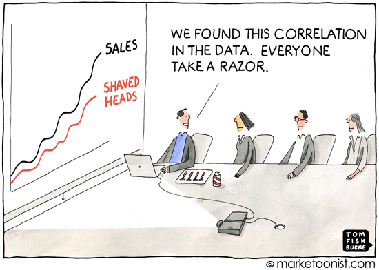

```{r setup, include=FALSE}
knitr::opts_chunk$set(echo = FALSE)
```

# Motivation

```{r, out.width= "80%", out.height = "80%", fig.align='center'}
library(knitr)
setwd("~/Desktop/SOSE2021/causal_ml")

```

# Introduction (1)

- Machine learning has provided many insights into different problems 
- One issue is the consideration of 'What are we actually predicting'?
- Mainstream tools are build on association-based learning 
- Associations are not enough for high stake settings 
- In disciplines like psychology or economics people are less interested in associational learning
- We want causation and not correlation 

# Introduction (2)

Causal assumptions differentiate causal models from association learning methods.

 | Association-based Concepts |  Causal Concepts
|--------------------------|------------------------|
| Correlation              | Randomization  
| Regression               | Confounding
| Conditional Independence | Disturbance
| Likelihood               | Error Terms      
| Odds Ratio               | Structural Coefficients       
| Propensity Score         | Spurious Correlation    


# Table of Contents

* Foundations of SCMs 
  * Assumptions 
  * Comparative Causal Tools 
  * Historical Development 
* Pearl's Causal Hierachy 
  * prediction 
  * intervention 
  * Counterfactuals 
  * Implications 
* Graphical Models 
  * Features 
  * Implications
* Causality and Time 

# Assumptions (1)

- Consists of system of equations 
- Assignment equation ':=' rather than regular equation '=' 
- is a nonparametric SEM 
- has functional form rather than using probabilities
- entails features from the PO framework and graphical representation 
- Exogenous factors are part of the model specification

# Assumptions (2)

**Error terms**

Regression: Omittable outside factor 
SCM/SEM; Latent influential factor that is pivotal for the model specification but not observable 

Consists of graph and assignments: 
Baseline: 

$$C:= N_c$$
$$E:=f_E(C,N_E)$$

source: @peters_elements_2017

# SCM Applications: 

- Flexible simulations for higher order problems (intervention, counterfactual)
- Graphical visualization via directed acyclic graph

# Comparative Causal Tools 

# Historical Development 

* Path Analysis -> SEM -> SCM

# Fundamental Differences (1)

- conflict whether to use graphs or not 
* A SEM is a parametric specification used in applied sciences (parameters contested)
* A Bayesian causal network is another popular causal model using conditional probabilities and NO functions 
* Differences in performance between BCN and SCM# Performance Evaluation

# Implications

 |Method         | CBN |  SCM
|----------------|---------------------------|------------------------|
| Prediction     | $\boldsymbol{\cdot}$ Unstable                                                                                        | $\boldsymbol{\cdot}$ Stable                 
|                | $\boldsymbol{\cdot}$ Volatile to parameter changes                                                                   | $\boldsymbol{\cdot}$ More Natural Specification 
|                | $\boldsymbol{\cdot}$ Re-Estimate entire model                                                                        | $\boldsymbol{\cdot}$ Only estimate $\Delta$ CM
|                |                                                                                                                      | 
| Intervention   | $\boldsymbol{\cdot}$ Costly for Non-Markovian Models                                                                 | $\boldsymbol{\cdot}$ Pot. Cyclic Representation
|                | $\boldsymbol{\cdot}$ Unstable(Nature CP)                                                                             | $\boldsymbol{\cdot}$ Stable(Nature Eq.)
|                | $\boldsymbol{\cdot}$ Only generic estimates($\Delta$ CP)                                                             | $\boldsymbol{\cdot}$ Context specific(Invariance of Eq.)
|                |                                                                                                                      | 
|Counterfactuals | $\boldsymbol{\cdot}$ **Impossible**                                                                                  | $\boldsymbol{\cdot}$ Possible
|                | $\boldsymbol{\cdot}$ no information on latent factors($\epsilon$)                                                    | $\boldsymbol{\cdot}$ Inclusion of latent factors


# Pearls Causal Hierachy 

\footnotesize
 |Method          | Action |  Example | Usage | 
|------------------|-------------|--------------------|-------------------|
| Association $P(a|b)$               | Co-occurrence             | What happened...               |(Un-)Supervised ML, BN, Reg.  
| Intervention $P(a|do(b),c)$       | Do-manipulation           | What happens if ...            |CBN,MDP,RL    
| Counterfactual $P(a_b|a`,b`)$     | Hypotheticals   | What would have happened if...           | SCM ,PO            

Table: Pearls Hierachy of Causation (2009)

\normalsize

# Prediction 

Vanilla machine learning (ML), bayesian networks (BN) and regression models (Reg) are at the lowest level in the causal hierarchy (see table 1).
These methods demand the least information and depend on association alone.
Associational methods ignore external changes outside of our data.
The interventional distribution has information on these external changes.
The interventional distribution is only defined in high level causal methods. 

# Intervention 

The second query deals with interventions.
Here we can use @pearl2009causality do-calculus.
The do-calculus enables us to study the manipulation of parent nodes.
 There are various types of intervention.
One example is **atomic intervention,** where we set a variable to a constant.
In **policy intervention** we specify a different function for an equation.
off-policy intervention models different intervention that is not in our historical data [@oberst2019counterfactual].
Causal bayesian networks , Markov Decision Processes (MDP) and reinforcement learning model intervention.

# Counterfactuals 

Process is described as follows:

(a) Abduction: Cast probability $P(u)$ as conditional probability $P(u|\epsilon)$ 
(b) Action: Exchange $(X = x)$ 
(c) Prediction: Compute $(Y = y)$

# Graphical Illustration

```{tikz,fig.align="center",fig.cap="Probabilistic Model", echo =F}
\usetikzlibrary{calc}
\usetikzlibrary{positioning}
\usetikzlibrary{arrows}
\begin{tikzpicture}[
    sharp corners=2pt,
    inner sep=7pt,
    node distance=3cm,
    >=latex]
\tikzstyle{my node}=[draw, shape = circle, minimum height=1cm,minimum width=1cm]
\node[my node] (A){A};
\node[my node,right =1 cm of A](C){C};
\node[my node] at ($(A)!0.5!(C)-(0pt,1.5cm)$) (T) {T};
\draw[->] (A) -- (T);
\draw[->] (A) -- (C);
\draw[->] (T) -- (C);
\end{tikzpicture}
```

```{tikz,fig.cap="Structural Causal Model", fig.align="center", echo =F}
\usetikzlibrary{calc}
\usetikzlibrary{positioning}
\usetikzlibrary{arrows}
\usetikzlibrary{calc}
\usetikzlibrary{positioning}
\usetikzlibrary{arrows}
  \begin{tikzpicture}[
    sharp corners=2pt,
    inner sep=6pt,
    node distance=2cm,
    >=latex]
\tikzstyle{my node}=[draw, shape = circle, minimum height=1cm,minimum width=1cm]
\tikzstyle{latent}=[draw, shape = rectangle, minimum height=1cm,minimum width=1cm]
\node[my node, fill=gray!30] (A){A};
\node[latent,left of=A](UA){$U_A$};
\node[my node, fill=gray!30] at ($(A)!0.5!(A)-(0pt,1.5cm)$) (T) {T};
\node[my node,right = 1 cm of T, fill=gray!30](C){C};
\node[latent,left = 1cm of T](UT){$U_T$};
\node[latent,right = 1cm of A](UC){$U_C$};
\draw[->] (A) -- (T);
\draw[->] (UA) -- (A);
\draw[->] (UT) -- (T);
\draw[->] (UC) -- (C);
\draw[->] (A) -- (C);
\draw[->] (T) -- (C);
\end{tikzpicture}
```

# Causality and Time

- Time in Physical Sciences: Mechanical and exact 
- Time in Social Sciences: Often Vague 
- Regular Time Specification is also more vague 
- To accomodate that issue, research on differential equation based SCMs started 

# References

